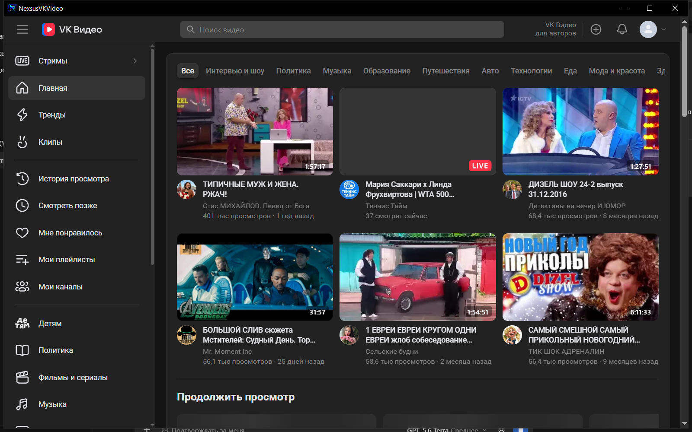

# NexsusVKVideo

[](https://github.com/nvros86/NexsusVKVideo/actions/workflows/build.yml)
[](https://github.com/nvros86/NexsusVKVideo/releases)
[](LICENSE)

NexsusVKVideo — лёгкая Windows-оболочка на WPF и WebView2 для официального сайта [VK Video](https://vkvideo.ru/). Она открывает сайт VK Video в отдельном окне приложения, сохраняя привычные возможности самого сайта: вход, каталог, поиск и воспроизведение.

> Это не неофициальный клиент VK API. Приложение не получает пароль, cookies или токены VK и не обходит DRM, авторизацию либо ограничения сайта.



_Скриншот сделан в `v0.2.0-beta.1` со свежим неавторизованным профилем WebView2. Контент внутри окна загружается непосредственно с официального сайта VK Video и принадлежит соответствующим правообладателям._

## Скачать

Актуальная beta-версия: [v0.2.1-beta.1](https://github.com/nvros86/NexsusVKVideo/releases/tag/v0.2.1-beta.1).

| Файл | Для чего |
|---|---|
| [NexsusVKVideo-Setup-0.2.1-beta.1.exe](https://github.com/nvros86/NexsusVKVideo/releases/download/v0.2.1-beta.1/NexsusVKVideo-Setup-0.2.1-beta.1.exe) | Рекомендуемый per-user установщик Windows x64. |
| [NexsusVKVideo.App.exe](https://github.com/nvros86/NexsusVKVideo/releases/download/v0.2.1-beta.1/NexsusVKVideo.App.exe) | Один standalone EXE без установки. |

Оба файла beta-версии пока не имеют цифровой подписи. Перед запуском сверяйте SHA-256 со значениями на [странице релиза](https://github.com/nvros86/NexsusVKVideo/releases/tag/v0.2.1-beta.1). Подписанный выпуск требует отдельного сертификата code signing.

## Возможности

- Официальный `vkvideo.ru` в собственном окне Windows, без отдельного браузера.
- Системная светлая/тёмная тема, восстановление размера и положения окна, корректная работа с несколькими мониторами.
- Полноэкранное видео WebView2.
- Восстановление запуска при отсутствии WebView2 Runtime или сетевой ошибке.
- Безопасные внешние HTTPS-ссылки — только после подтверждения в системном браузере.
- Загрузки только с защищённых доменов VK.
- Локальная диагностика, очистка профиля по явному действию и безопасная проверка обновлений.

## Требования

- Windows x64.
- Интернет-подключение.
- [Microsoft Edge WebView2 Evergreen Runtime](https://developer.microsoft.com/microsoft-edge/webview2/).

Установщик не требует прав администратора. Если WebView2 Runtime отсутствует, приложение покажет ссылку на официальную страницу Microsoft.

## Горячие клавиши

| Сочетание | Действие |
|---|---|
| `Alt+←` / `Alt+→` | Назад / вперёд по истории VK Video |
| `F5` или `Ctrl+R` | Обновить текущую страницу |
| `Ctrl++` / `Ctrl+-` / `Ctrl+0` | Изменить масштаб / вернуть 100% |
| `Ctrl+Shift+Delete` | Запланировать очистку локальных данных WebView2 при следующем запуске |
| `Ctrl+Shift+D` | Показать локальный диагностический отчёт |
| `Ctrl+Shift+U` | Проверить более новую опубликованную beta-версию |

Очистка всегда требует подтверждения. Она удаляет локальные cookies, активный вход и настройки сайта VK Video при следующем запуске; приложение не экспортирует эти данные.

## Конфиденциальность и безопасность

- Верхнеуровневая навигация ограничена HTTPS-доменами VK.
- HTTP и неподдерживаемые схемы не выполняются.
- Внешние ссылки никогда не запускаются молча.
- Диагностический отчёт не содержит URL, историю, cookies, учётные данные или локальные пути и не отправляется по сети.

Подробности: [SECURITY.md](SECURITY.md).

## Для разработчиков

Нужен .NET SDK `10.0.401`, закреплённый в [global.json](global.json).

```powershell
dotnet restore NexsusVKVideo.sln
dotnet build NexsusVKVideo.sln -c Release --no-restore
dotnet test NexsusVKVideo.sln -c Release --no-build
```

Сборка установщика с Inno Setup 7:

```powershell
powershell -ExecutionPolicy Bypass -File scripts/Build-Installer.ps1
```

Workflow `publish beta release` повторяет restore, build и test на GitHub Actions, затем собирает installer и standalone EXE для уже созданного tag.

## Документация

- [Изменения](CHANGELOG.md) и [план версий](docs/FEATURE_ROADMAP.md).
- [Архитектура](docs/ARCHITECTURE.md), [модули](docs/MODULES.md) и [решения](docs/decisions/README.md).
- [Сборка, проверка и release-процесс](CODEX_WORKFLOW.md), [RELEASE_PROCESS.md](RELEASE_PROCESS.md).
- [Как участвовать](CONTRIBUTING.md), [политика безопасности](SECURITY.md), [поддержка](SUPPORT.md).

Логотип был предоставлен владельцем проекта; происхождение описано в [assets/branding/README.md](assets/branding/README.md).

## Лицензия

Исходный код, документация и оригинальные assets проекта распространяются по [лицензии MIT](LICENSE). Copyright (c) 2026 nvros86. Для элементов, принадлежащих третьим лицам, действуют [отдельные notices](NOTICE.md).
